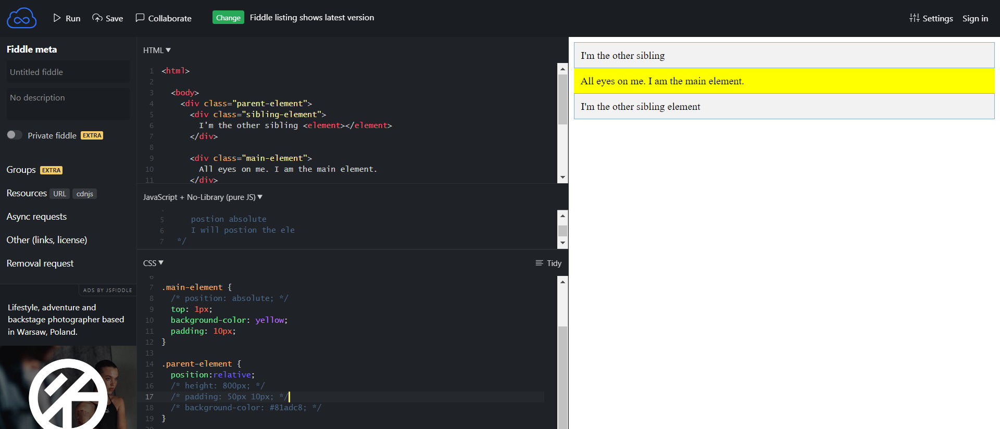

https://codepen.io/enxaneta/full/adLPwv/

https://jsfiddle.net/ar90xj86/3/
https://jsfiddle.net/h1uydxep/2/
https://jsfiddle.net/fm94ehou/
https://jsfiddle.net/7jucensr/18/

https://jsfiddle.net/8yu26fpx/2/

https://flexboxfroggy.com/

now elements are completely aligned.

/* 
    four values can be in position 
    top left right bottom
*/

we dont usually dont use postion relative mostly use but we use position absolute 

position absolute
---------------
I will position the element on which this property is given based on the last position element or the window itself.

last position element means the element which is the parent of this element. 
follows the hierarchy chain of the elements.

without postion absolute in main element this will be the result

with position absolute in main element this will be the result

what it means is this element has become oprhan 
it is come out of parent element , it is not caring about the parent element anymore.

I am not going to care about the parent element anymore.

position absolute postions itself to the nearest ancestor element which has position value.

.main-element {
  position: absolute;
  top: 1px;
  background-color: yellow;
  padding: 10px;
  /* top: 0px; */
  /* left: 0px; */
  /* right:0px; */
  /* bottom:0px; */
 
}

.main-element {
  position: absolute;
  /* top: 1px; */
  background-color: yellow;
  padding: 10px;
  top: 0px;
  left: 0px;
  /* right:0px; */
  /* bottom:0px; */
 
}

.main-element {
  position: absolute;
  /* top: 1px; */
  background-color: yellow;
  padding: 10px;
  top: 0px;
  left: 0px;
  right:0px;
  /* bottom:0px; */
 
}

.main-element {
  position: absolute;
  /* top: 1px; */
  background-color: yellow;
  padding: 10px;
  top: 0px;
  /* left: 0px; */
  right:0px;
  /* bottom:0px; */
 
}

.main-element {
  position: absolute;
  /* top: 1px; */
  background-color: yellow;
  padding: 10px;
  top: 0px;
  /* left: 0px; */
  right:0px;
  bottom:0px;
 
}

.main-element {
  position: absolute;
  /* top: 1px; */
  background-color: yellow;
  padding: 10px;
  /* top: 0px; */
  /* left: 0px; */
  /* right:0px; */
  bottom:0px;
 
}

20.3 rem is 203 px 

rem is relative to the root element which is html element

.main-element {
  position: sticky;
  top: 0px;
  background-color: yellow;
  padding: 10px;
  /* top: 0px; */
  /* left: 0px; */
  /* right:0px; */
  bottom:0px;
}

as I am scrolling out of the window the element is going to stick to the top of the window.

sticky is a combination of relative and fixed position.

for 99% of the time we use position relative for  position absolute , like for parent hierachy we use position relative and for child we use position absolute.

