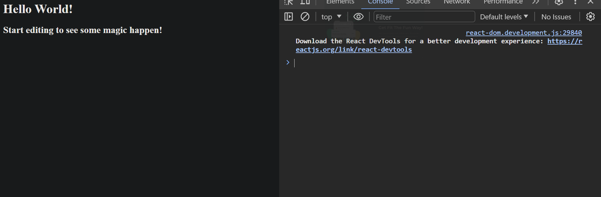

[Link to Sid sir Code Sandbox](https://codesandbox.io/s/compassionate-forest-vwv5m9?file=/src/index.js)

agenda for next 9 classes

- React -  1
- Today
- Basics of react
- JSX
- Components
- Package.json
- Different Packages
- Props

- States
- Hooks in react
- Function Components
- Context API
- Redux
- Redux thunk
- Best practices in react
- Custom Hooks
- Interview questions of react
- virtual DOM
- controlled and uncontrolled components
- lifecycle methods
- HOC and render props in react => Higher order components

React is built on top of javascript and it is a library
React is a library for building user interfaces  
library vs framework

- library is a collection of functions which you can use in your code
- framework is a collection of libraries
- library is a tool which you can use in your code
- framework is a tool which uses your code
- library is a collection of functions
- framework is a collection of libraries
- framework is closed environment where you have to follow the rules of framework whreas in library you can use it in your own way
- framework is dictatorship and library is democracy

```js
var d = document.getElementById("root");
d.innerText="some text";
d.setAttribute("class","someclass");
body.appendChild(d);
```

- then jquery came , this revolutionized the way we write javascript , but the problem with jquery is that heavy bundle size it providing lot of features which we dont need which slows down the application , it is a heavy framework , it is a heavy bundle size , it is a heavy learning curve , it is a heavy boilerplate code , it is a heavy everything

- then angular came , angular is a framework , it is a collection of libraries , it is a closed environment , it is a dictatorship , it is a heavy framework , it is a heavy bundle size , it is a heavy learning curve , it is a heavy boilerplate code , it is a heavy everything

- change something in html and want it to reflect in js
- change something in js and want it to reflect in html
- providing sync between html and js
- you have to follow the rules that I recommend

- then react came , it is a library , it is a collection of functions , it is a open environment , it is a democracy , it is a light framework , it is a light bundle size , it is a light learning curve , it is a light boilerplate code , it is a light everything
- created and backing  by facebook
- with ease of creating components
- I will keep the flow in one direction
- Parent to child
- Uni directional data flow
- SPA => Single page application
- without refreshing the page I will change the content of the page
- huge developer community of react
- virtual DOM => Document object model

- npm => node package manager
- create-react-app => it is a package which will create a react application for you
- npx => node package executer
- npx create-react-app my-app
- npm vs npx
  - npm used when you want to install a package and use it in your code
  - npx is used to run a package without installing it and then remove it and then run it again and again
  - npx is like reading the book in library and npm is like taking the book home
  - npx is like using the tool and npm is like installing the tool
  - npx is used in development environment and npm is used in production environment
  - npx is used to run the package and npm is used to install the package
  - npx will downloaded to $HOME/.npm/_npx/ folder (temp folder) and then it will run the package and then it will remove the package from the temp folder

- ENOENT: no such file or directory, lstat 'C:\Users\abhil\AppData\Roaming\npm' got this error while installing create-react-app
  - solved by adding npm folder in that location

- other ways to create react app
  - using webpack => webpack is a module bundler
  - explain webpack in detail

- package.json => it is a file which contains all the information about the project
- package-lock.json => it is a file which contains all the information about the packages which are installed in the project
- node_modules => it is a folder which contains all the packages which are installed in the project
- public => it is a folder which contains all the static files
- src => it is a folder which contains all the dynamic files

- react follows node style coding
- node style coding => it is a style of coding in which we use import and export instead of require and module.exports
- npm init

create package.json file for react

```js

{
    "name": "react-sessions",
    "version": "1.0.0",
    "description": "this is a react app",
    "main": "src/index.js", // entry point of the application
    "dependencies": {
        "loader-utils": "3.2.1",
        "react": "18.2.0",
        "react-dom": "18.2.0",
        "react-scripts": "5.0.1"
    }
    "devDependencies": {
        "@babel/runtime": "7.13.8",
        "typescript": "4.1.3"
    },
    "scripts": {
        "start": "react-scripts start",
        "build": "react-scripts build",
        "test": "react-scripts test",
        "eject": "react-scripts eject"        
    },
   "browserlist":[
       ">0.2%",
       "not dead",
       "not ie <= 11",
       "not op_mini all"
    ]
    
}        

```

- react => it is a package which is used to create the react application ,gives the react syntax
- react-dom => it is a package which is used to render the react code in the browser
- react-native => it is a package which is used to render the react code in the mobile

- how to install the packages in react
  - npm install
- all these packages are installed in node_modules folder

- what is this version number in package.json
  - eg : "react": "18.2.0",
  - 18 => major version
  - 2 => minor version
  - 0 => patch version
  - major version => it is a version which is used to indicate that there is a breaking change in the package
  - minor version => it is a version which is used to indicate that there is a new feature added in the package
  - patch version => it is a version which is used to indicate that there is a bug fix in the package
  - ^ => it is a symbol which is used to indicate that you can update the minor and patch version but not the major version
    - eg : "react": "^18.2.0",
  - ~ => it is a symbol which is used to indicate that you can update the patch version but not the major and minor version
    - eg : "react": "~18.2.0",
  - \* => it is a symbol which is used to indicate that you can update the major , minor and patch version
    - eg : "react": "\*",
  - "" => it is a symbol which is used to indicate that you can update the major , minor and patch version

- webpack => it is a module bundler
  - job of webpack is to bundle all the files into one file

- react app started by npm startS


- component is a functio which returns some html ie jsx code and it is reusable
- jsx => javascript xml , it is a syntax which is used to write html in javascript
- jsx is known as component in react
- function component

- name of the component should start with capital letter pascal case eg : App, Abc, AbcDef
