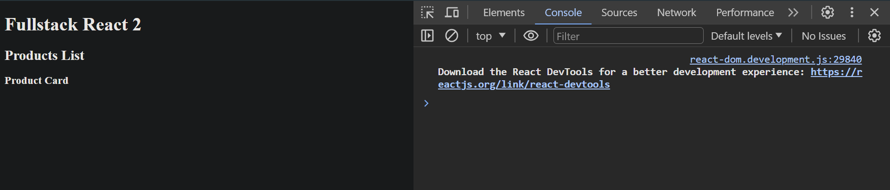

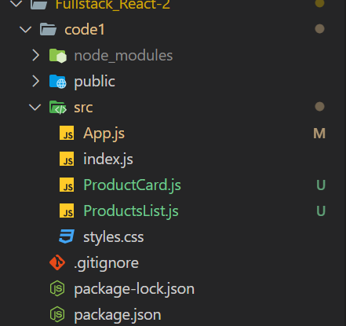

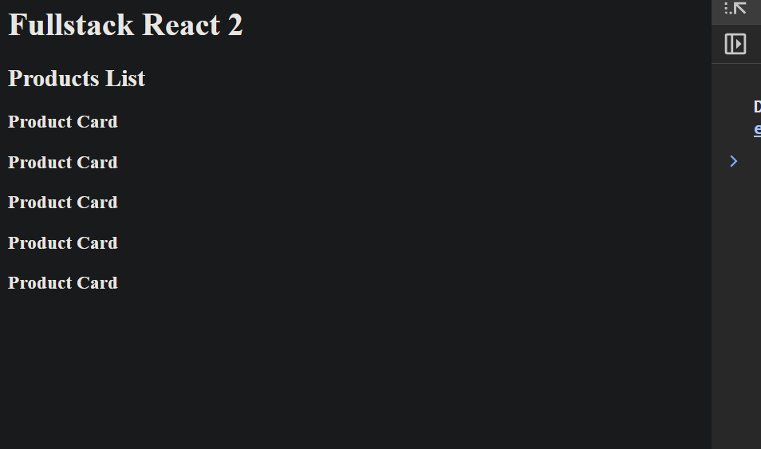

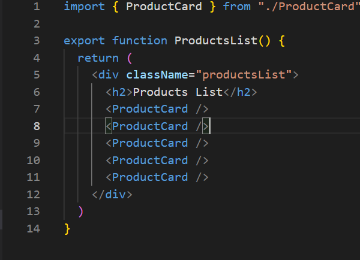

component here made dynamic in nature, using props

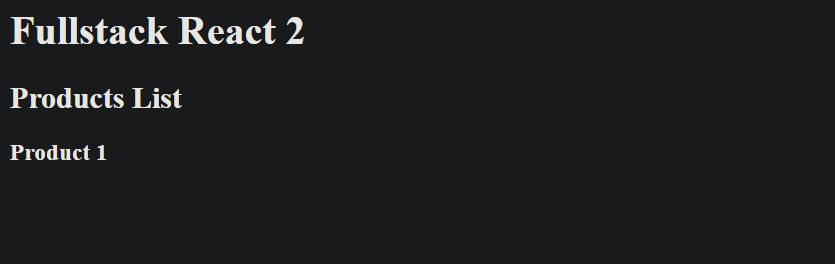

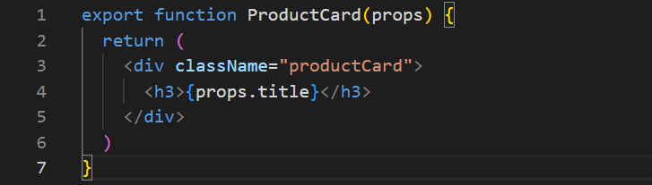

using props to make component dynamic and curly braces to use javascript inside jsx
props is an object that contains all the properties that we pass to the component

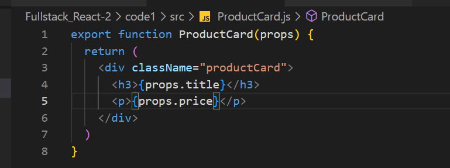

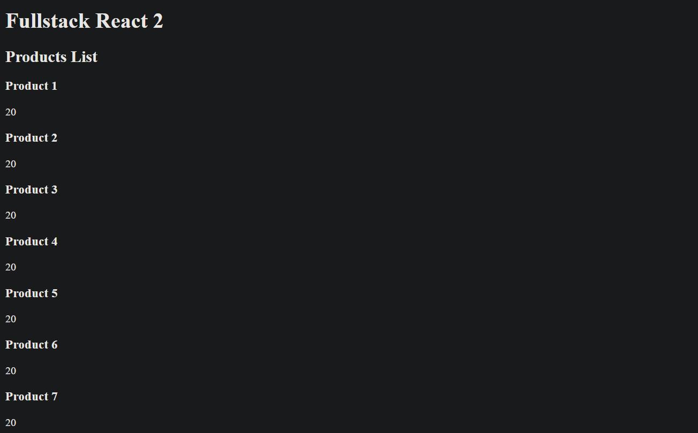

can we say its like argument we pass to a function


using map 
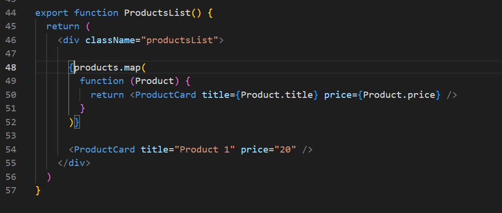


why curly braces in map
anything inside curly braces is javascript expression 

```javascript
      {products.map(
        function (Product) {
          return <ProductCard title={Product.title} price={Product.price} />
        }
      )}
// above can be writtern as below
      {
        products.map((Product) => {
          return <ProductCard title={Product.title} price={Product.price} />
        })
      }

```

why this is not scalable , what if we have 1000 products then we have to write 1000 lines of code


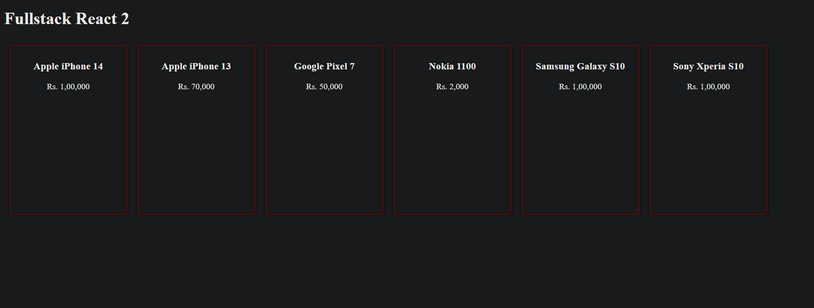

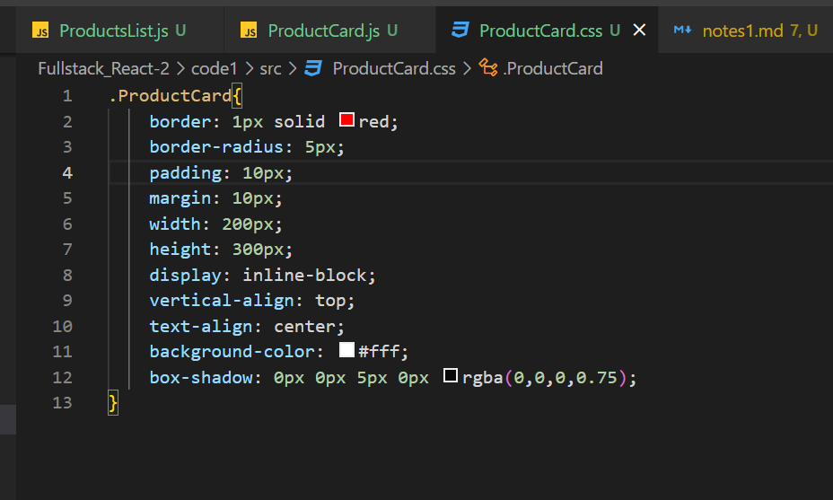

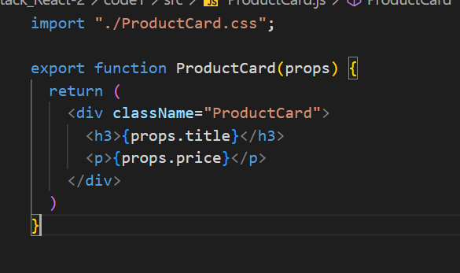

why className instead of class ?
because class is a reserved keyword in javascript

also  we need to import css file in index.js file to use css in our project


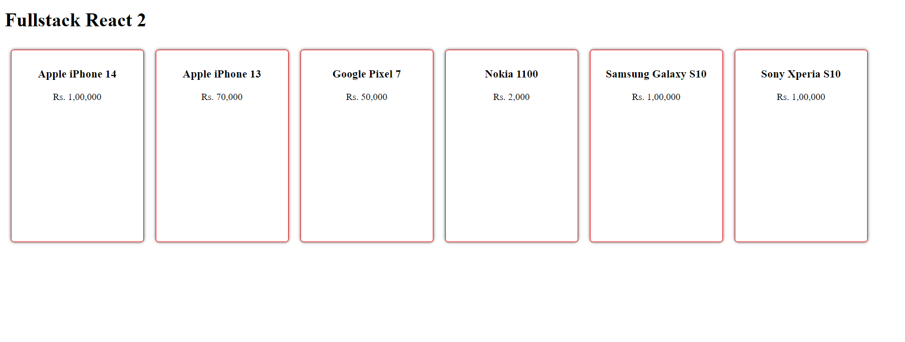

we have to create folder named components and inside that folder we have to create ProductCard.js file

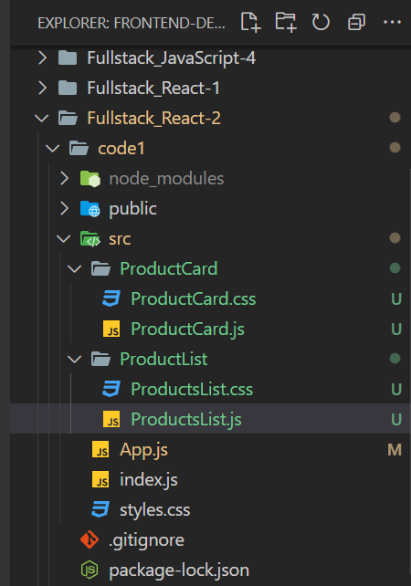

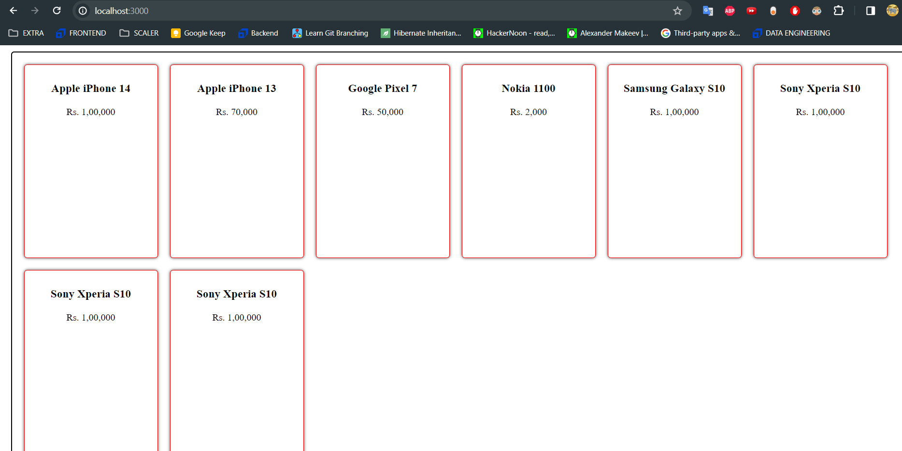

jsx or js both can be used in react , jsx preferred as it adds readability to the code

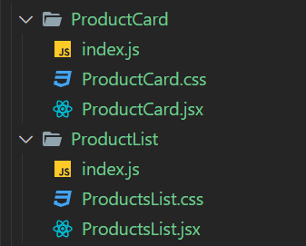

here we index js file for product card component and product list component
acts as a entry point for the component
and also aggreator for all the files in the folder


named export and default export ?
named export is used when we have multiple components in a file
default export is used when we have only one component in a file


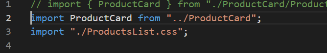
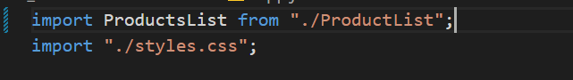

import { ProductsList } from "./ProductList/ProductsList.js";
import ProductsList from "./ProductList";

the above follow and checks any of the below file exists or not then throw error

// ProductList.js
// ProductList.jsx
// ProductList/index.js
// ProductList/index.jsx

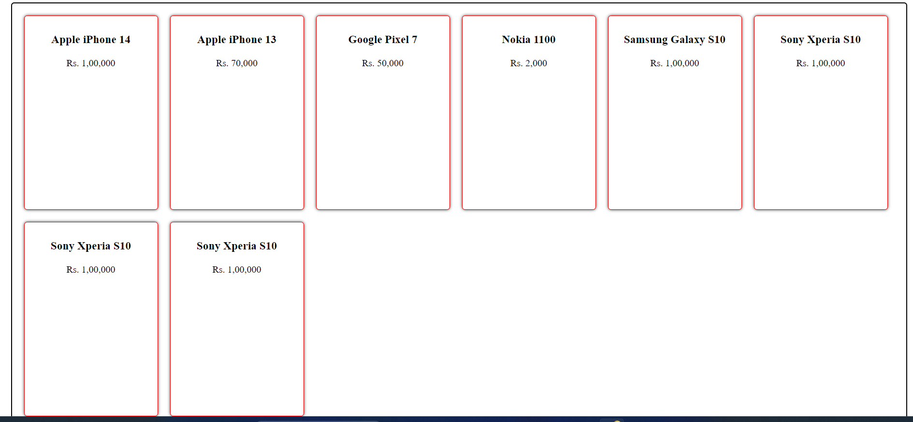