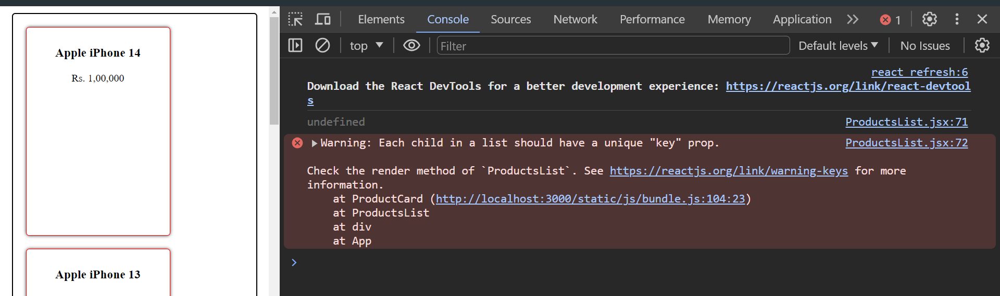
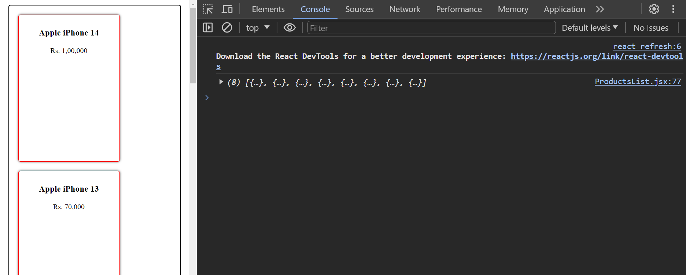
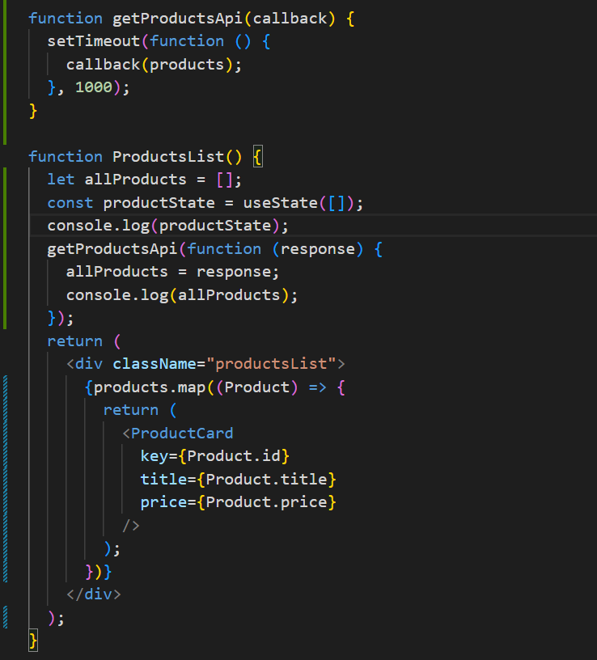
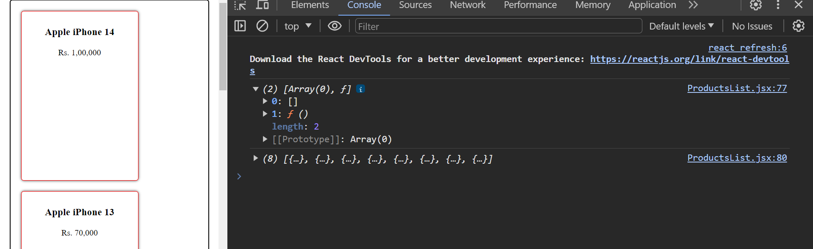
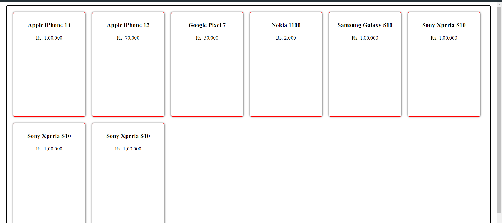
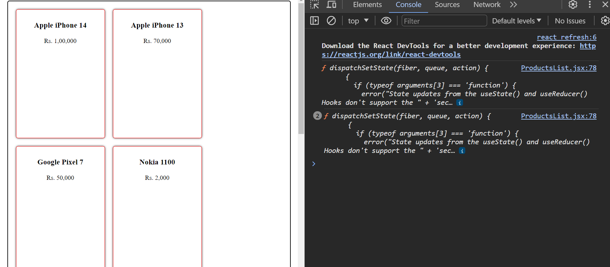
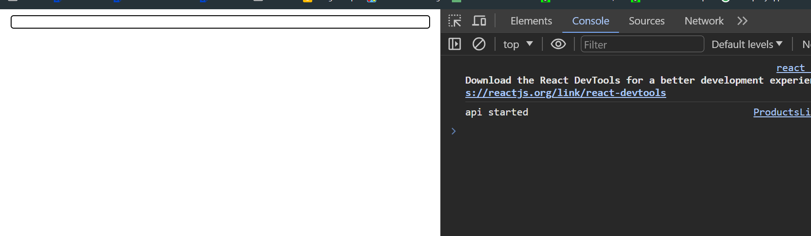
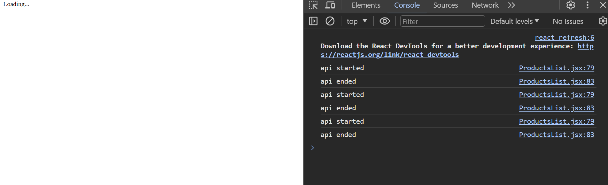
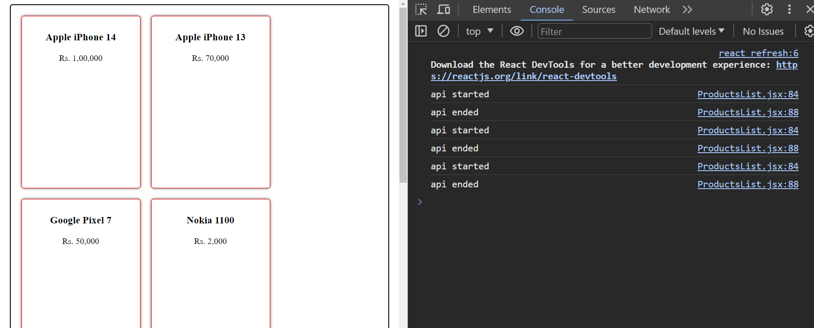

```javascript
function getProductsApi() {
  setTimeout(function () {
    return products;
  }, 1000);
}
```



as you can see js return undefined because it doesn't wait for the setTimeout to finish.

### Solution 1: Callbacks

```javascript
function getProductsApi(callback) {
  setTimeout(function () {
    callback(products);
  }, 1000);
}

function ProductsList() {
  let allProducts = [];
  getProductsApi(function (response) {
    allProducts = response;
    console.log(allProducts); // [{id: 1, title: "product 1", price: 100}, {id: 2, title: "product 2", price: 200}]
  });
  console.log(allProducts); // [] why? because js doesn't wait for the setTimeout to finish. so it will execute the next line of code.
  return (
    <div className="productsList">
      {products.map((Product) => {
        return (
          <ProductCard
            key={Product.id}
            title={Product.title}
            price={Product.price}
          />
        );
      })}
    </div>
  );
}
```



- what is happening here is that we are passing a function as a parameter to getProductsApi function and then we are calling that function inside the setTimeout function.
- What is call back function? it is a function that is passed as a parameter to another function and then it is called inside that function.

eg of callback function:

```javascript
function add(a, b, callback) {
  callback(a + b);
} 

add(2, 3, function (result) {
  console.log(result); // 5
});

```

What is Closure? it is a function that has access to the parent scope, even after the parent function has closed.

example of closure:

```javascript
function add(a, b) {
  let result = a + b;
  return function () {
    console.log(result);
  };
}

let addResult = add(2, 3);
addResult(); // 5
```

another example of closure:

```javascript
function add(a, b) {
  let result = a + b;
  return function (c) {
    console.log(result + c);
  };
}

let addResult = add(2, 3);
addResult(5); // 10
```

require more understanding on callback and closure

State: it is a javascript object that holds the data of the component. when the state changes, the component will re-render.

```javascript
import React, { useState } from "react";

function ProductsList() {
  const [products, setProducts] = useState([]);

  function getProductsApi(callback) {
    setTimeout(function () {
      callback(products);
    }, 1000);
  }

  getProductsApi(function (response) {
    setProducts(response);
  });

  return (
    <div className="productsList">
      {products.map((Product) => {
        return (
          <ProductCard
            key={Product.id}
            title={Product.title}
            price={Product.price}
          />
        );
      })}
    </div>
  );
}
```

- what is this state variable
- how do we create this state variable
- how do we update this state variable

state variable is created using useState hook. useState hook returns an array with two elements. first element is the state variable and second element is the function to update the state variable.

state variable  whose value when set will rerender the whole component

how do we create this state variable

- React hooks are functions that let us hook into the react state and lifecycle features from function components.
- Hooks are helper functions that allow us to do things like manage state, lifecycle methods, and perform side effects in function components.
- Hooks are functions that let us hook into the react state and lifecycle features from function components.
- Hooks says I will provide you with some custom hooks which come out of the box
- you can also create these hooks
- useName is a custom hook pattern
- useState => is a hook that comes out of the box with react
- useState => is a function that takes one argument which is the initial value of the state variable and returns an array with two elements. first element is the state variable and second element is the function to update the state variable.
- useState(defaultValue) => [stateVariable, setStateVariable]





```javascript
const productState = useState([]);
```

this is returning an array with two elements. first element is the state variable and second element is the function to update the state variable.

- state variable cant be set directly like another variable
- it has to be set using setter function returned from useState

```javascript


function getProductsApi(callback) {
  setTimeout(function () {
    callback(products);
  }, 1000);
}

function ProductsList() {
  const productState = useState([]);
  let allProducts = productState[0];
  let setAllProducts = productState[1];
  console.log(setAllProducts);

  getProductsApi(function (response) {
    setAllProducts(response);
  });
  return (
    <div className="productsList">
      {allProducts.map((Product) => {
        return (
          <ProductCard
            key={Product.id}
            title={Product.title}
            price={Product.price}
          />
        );
      })}
    </div>
  );
}


export default ProductsList;
```

output  






as you can see the state variable is not updated. it is still empty array. why? because the component is not re-rendered. so we need to call the setAllProducts function to update the state variable. only after settimeout time runs out.

create a loader, when the data is loading show the loader and when the data is loaded hide the loader.

 ```javascript
 
 

function ProductsList() {
  let isLoading = true;
  const productState = useState([]);
  let allProducts = productState[0];
  let setAllProducts = productState[1];
  console.log("api started");

  getProductsApi(function (response) {
    setAllProducts(response);
    console.log("api ended");
    isLoading = false;
  });

  if (isLoading) {
    return <div>Loading...</div>;
  } else {
    return (
      <div className="productsList">
        {allProducts.map((Product) => {
          return (
            <ProductCard
              key={Product.id}
              title={Product.title}
              price={Product.price}
            />
          );
        })}
      </div>
    );
  }
}

export default ProductsList;


 ```

output




why this loading is not removed ?


```javascript


function getProductsApi(callback) {
  setTimeout(function () {
    callback(products);
  }, 5000);
}

function ProductsList() {

  const loadingState = useState(true);
  let isLoading = loadingState[0];
  let setIsLoading = loadingState[1];

  const productState = useState([]);
  let allProducts = productState[0];
  let setAllProducts = productState[1];

  console.log("api started");

  getProductsApi(function (response) {
    setAllProducts(response);
    console.log("api ended");
    setIsLoading(false);
  });

  if (isLoading) {
    return <div>Loading...</div>;
  } else {
    return (
      <div className="productsList">
        {allProducts.map((Product) => {
          return (
            <ProductCard
              key={Product.id}
              title={Product.title}
              price={Product.price}
            />
          );
        })}
      </div>
    );
  }
}

export default ProductsList;

```
now we are getting the values



- rendering 1 time , reredering 2 times , why? because we are calling the setAllProducts function 2 times. first time with empty array and second time with the products array.
- so we need to call the setAllProducts function only once. so we need to call the setAllProducts function only after the api call is completed.
- so we need to call the setAllProducts function only after the api call is completed.
- mounting => when the component is created and added to the dom
- updating => when the component is updated
- let [isLoading, setIsLoading] = useState(true); => this is called array destructuring , it is a way to extract values from an array and assign them to variables and cleaner way
