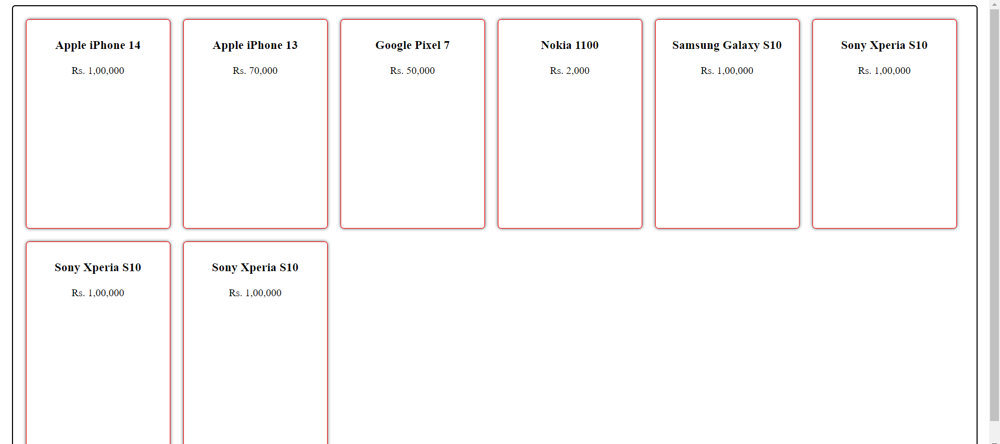
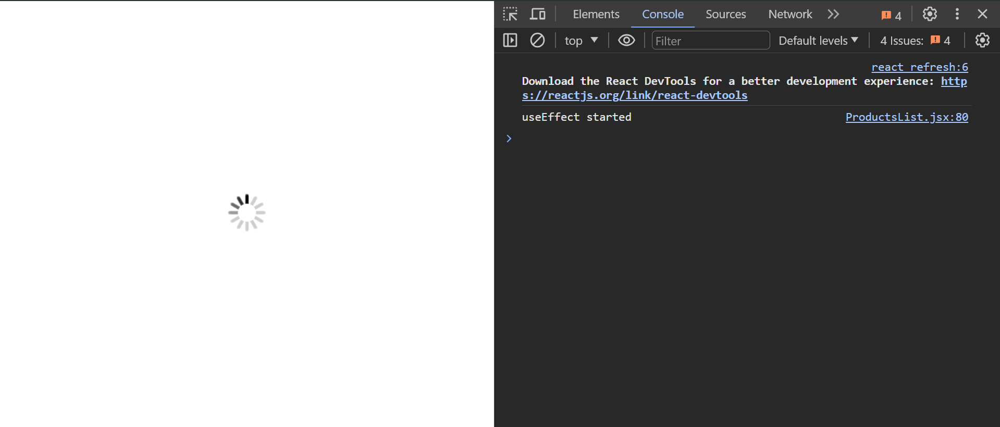
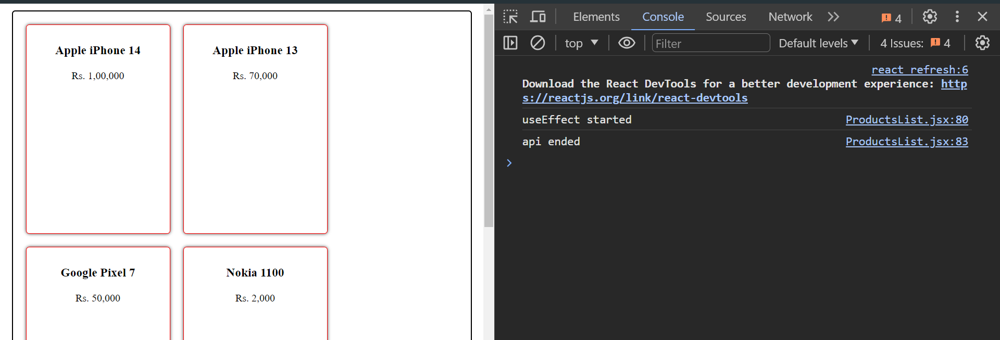
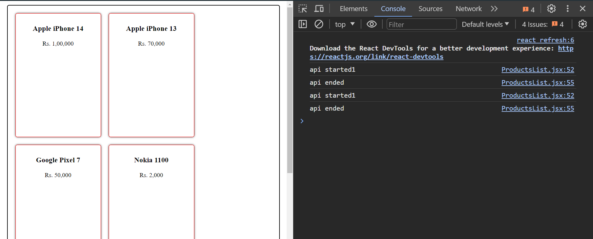
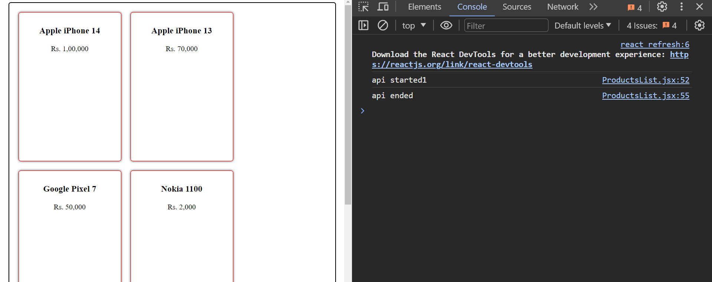
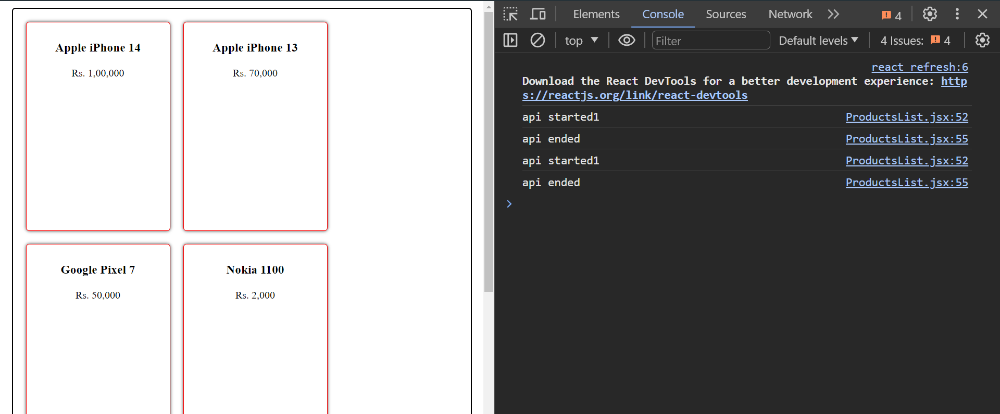
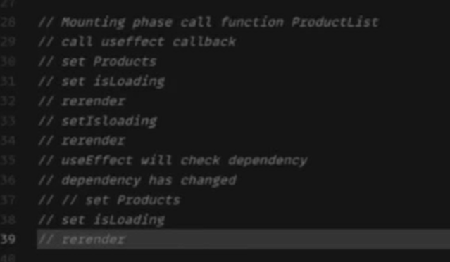

# React - 4

 What is next js?

- next js is a framework for react
- it is a framework for server side rendering
- it is a framework for static site generation
- it is a framework for dynamic site generation
- it is a framework for server side rendering
- use to make seo optimized react app  
- wrapper on top of react

# useEffect

- useEffect is a hook that lets you perform side effects in functional components
- example  useEffect(() => { console.log('hello') }, [])
- explain the above example
- this hook is called every time a component rendered
- what is mount and unmount of a component
- mount is when a component is rendered for the first time
- unmount is when a component is removed from the dom
  
# gif code for loading


 
code for loading gif

  ```javascript
   if (isLoading) {
    // return <div>Loading...</div>;
    return (
     
    ) 
  }
  ```

previous code

```javascript
if (isLoading) {
    return <div>Loading...</div>;
}
```

- best practice is to use loader component instead of loading text Assignment 1: create a loader component and use it in the app

```javascript

useEffect(() => {
    console.log("useEffect started");
    getProductsApi(function (response) {
      setAllProducts(response);
      console.log("api ended");
      setIsLoading(false);
    });
  }, []);

```

- useEffect is called every time a component is rendered
- useEffect is called when a component is mounted
- useEffect is called when a component is unmounted
- useEffect is called when a component is updated





```javascript
  useEffect(() => {
    getProductsApi(function (response) {
      console.log("api started1");
      setAllProducts(response);
      setIsLoading(false);
      console.log("api ended");
    });
  } );
```

the above code will get



```javascript
  useEffect(() => {
    getProductsApi(function (response) {
      console.log("api started1");
      setAllProducts(response);
      setIsLoading(false);
      console.log("api ended");
    });
  }, []);
```

the above code will get


**useEffect(callback,dependencyArray)**

```javascript
  useEffect(() => {
    getProductsApi(function (response) {
      console.log("api started1");
      setAllProducts(response);
      setIsLoading(false);
      console.log("api ended");
    });
  },[allProducts,isLoading] );
```



useeffect is called when a component is mounted
and when states (allProducts,isLoading) either of these are changed.

- useEffect would be called once on mounting
- next everytime on state change of dependency array variables.

## useEffect on going

- Mounting phase call function ProductList()
- call useEffect callback  getProductsApi()
- set Products setAllProducts(response)
- set isLoading setIsLoading(false);
- above two steps are called batching
- rerennder
- set isLoading setIsLoading(false);
- rerender
- useEffect  will check dependecy
- dependecy has changed
- set Products setAllProducts(response)
- set isLoading setIsLoading(false);
- rerender



## virtual dom

- virtual dom is a copy of the real dom in memory

```js
// VDOM -> JSON reprentation of DOM
// let currentVdom = {
//   nodeName: 'div',
//   children: [
//     {
//       nodeName: 'ul',
//       properties: {
//         className: 'list',
//          id: 'ul'
//         children: [
//           {
//             nodeName: 'li',
//             properties: {
//               id: 'item-1',
//               children: [
//                 {
//                   nodeName: 'a',
//                   children: ['Item 1']
//                 }
//               ]
//             }
//           },
//           {
//             nodeName: 'li',
//             properties: {
//               children: [
//                 'Item 2'
//               ]
//             }
//           },
//           {
//             nodeName: 'li',
//             properties: {
//               children: [
//                 'Item 3'
//               ]
//             }
//           }
//         ]
//       }
//     },
//     {
//       nodeName: 'button',
//       children: ['Toggle']
//     }
//   ]
// }

// let newVDom = {
//   nodeName: 'div',
//   children: [
//     {
//       nodeName: 'ul',
//       properties: {
//         className: 'list',
//         children: [
//           {
//             nodeName: 'li',
//             properties: {
//               id: 'item-1',
//               children: [
//                 {
//                   nodeName: 'a',
//                   children: ['Item 1']
//                 }
//               ]
//             }
//           },
//           {
//             nodeName: 'li',
//             properties: {
//               children: [
//                 'Item 2'
//               ]
//             }
//           },
//           {
//             nodeName: 'li',
//             properties: {
//               children: [
//                 'Item 3'
//               ]
//             }
//           },
//           {
//             nodeName: 'li',
//             properties: {
//               children: [
//                 'Item 4'
//               ]
//             }
//           }
//         ]
//       }
//     },
//     {
//       nodeName: 'button',
//       children: ['Toggle']
//     }
//   ]
// }

// diff = diffAndGenerateChanges(currentVdom, newVDom);

//// {
//   action: 'addNode',
//   nodeDetails: {
//     nodeName: 'li',
//     properties: {
//       children: [
//         'Item 4'
//       ]
//     }
//   }
// }

// oldDom = [
//   <ProductCard  key={v1} title="Title 1" />,
//   <ProductCard  key={v2} title="Title 2" />,
//   <ProductCard  key={v3} title="Title 3" />
// ]

// Without keys [{title change}, {title change}, {append node}]
// With keys [{append node after key v1}]

// newDom = [
//   <ProductCard key={v1} title="Title 1" />,
//   <ProductCard key={v4} title="Title 4" />,
//   <ProductCard key={v2} title="Title 2" />,
//   <ProductCard key={v3} title="Title 3" />
// ]
// oldDom = [
//   <ProductCard title="Title 1" />,
//   <ProductCard title="Title 2" />,
//   <ProductCard title="Title 3" />
// ]

// Without keys [{title change}, {title change}, {append node}]
// With keys [{append node after key v1}]

// newDom = [
//   <ProductCard title="Title 1" />,
//   <ProductCard title="Title 4" />,
//   <ProductCard title="Title 2" />,
//   <ProductCard title="Title 3" />
// ]
```

# Sid sir code for virtual dom and others

<https://react.dev/learn/rendering-lists#keeping-list-items-in-order-with-key>

<https://bundlephobia.com/>

<https://codesandbox.io/p/sandbox/react-sessions-7cnm7x?file=%2Fsrc%2FComponents%2FProductsList%2FProductsList.jsx>

<https://codesandbox.io/p/sandbox/react-i-forked-ki010w?file=%2Fsrc%2Findex.js%3A8%2C1>

use paint flashes to see the difference
with vanilla js and react

- with keys are more efficient than without keys

## Sid sir dummy url for api created

 [dummy url sir created for product api ](https://602fc537a1e9d20017af105e.mockapi.io/api/v1//products)
