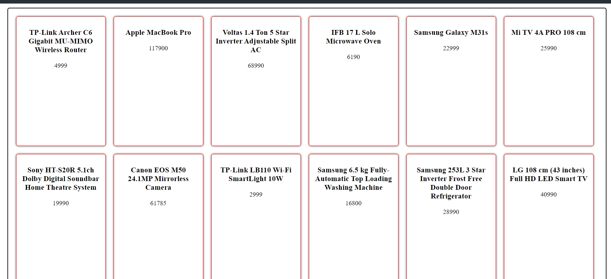
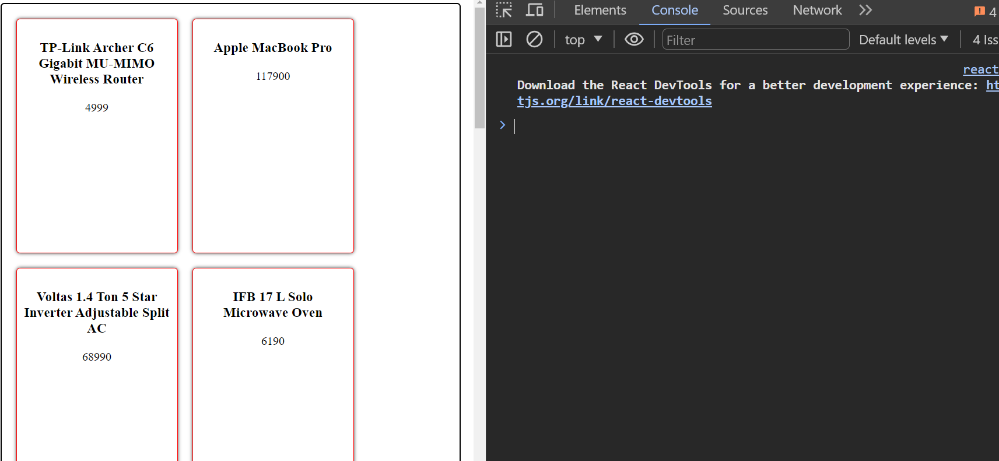
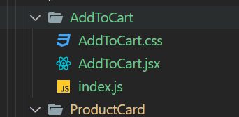
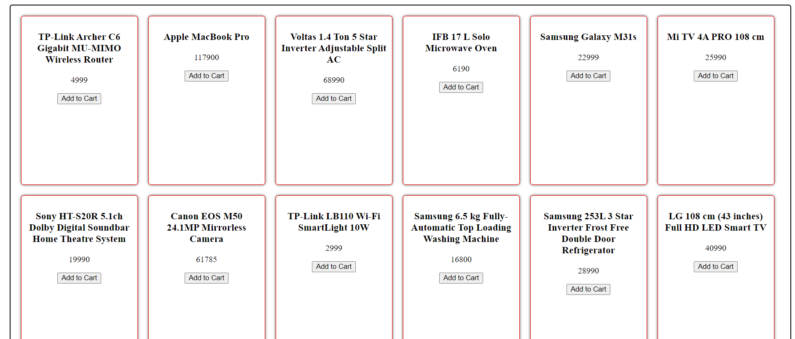
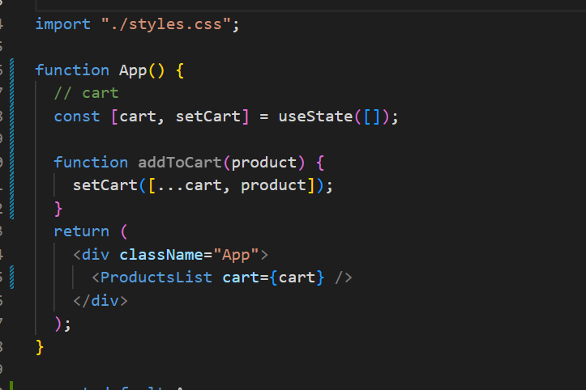
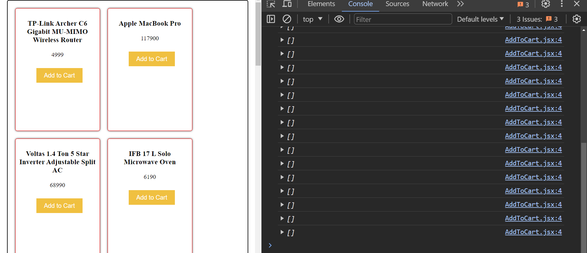
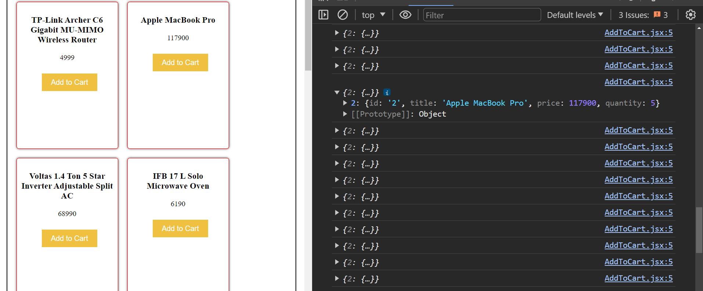
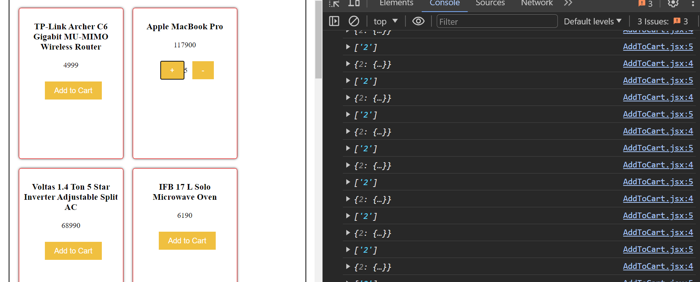
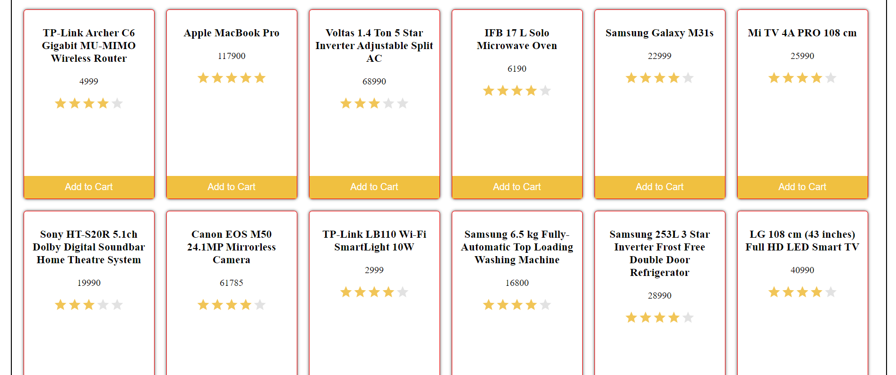

# React Project 2

internally fetch uses xmlhttp, promise these 2 things

## Fetch

- Fetch is a browser API
- Fetch is a function that returns a promise
- Fetch is a promise that resolves to a response object that has a json method that returns a promise

syntax

    ```js
    fetch(url)
        .then(response => response.json())
        .then(data => console.log(data))
        .catch(error => console.log(error))
    ```

[dummy url sir created for product api](https://602fc537a1e9d20017af105e.mockapi.io/api/v1//products)

```js

  useEffect(() => {
    fetch("https://602fc537a1e9d20017af105e.mockapi.io/api/v1//products")
      .then((response) => {
        return response.json()
      })
      .then((data) => {
        setIsLoading(false);
        setAllProducts(data);
      });
  }, []);
```

output



fetch is js function that returns a promise, promise resolves to a response object that has a json method that returns a promise

## Task

- Add to cart Component
- Cart page in order to display the cart items
- Cart context to manage the cart state
- Function needed  to update the global state
- global state would be available in App.js
- global state and function would be needed to pass to all the components

## Note to Remember

for index.js use only small caps for file name and for component use capital letter for file name





*What is prop drilling ?*

- passing props from a component to another component that is not directly connected to it
- basically passing props from a parent component to a child component that is not directly connected to it.






notes
maintaing order is important for props drilling

```js
  function increaseQuantity(product) {
    const newCart = { ...cart };
    if (!newCart[product.id]) {
      newCart[product.id] = {
        id: product.id,
        title: product.title,
        price: product.price.value,
        quantity: 0
      };
    }
    newCart[product.id].quantity += 1;
    setCart(newCart);
  }
  ```

  

add sub output

  


- Redux global state management
- Context api 

redux vs context 

*redux vs context *


Rating component added
