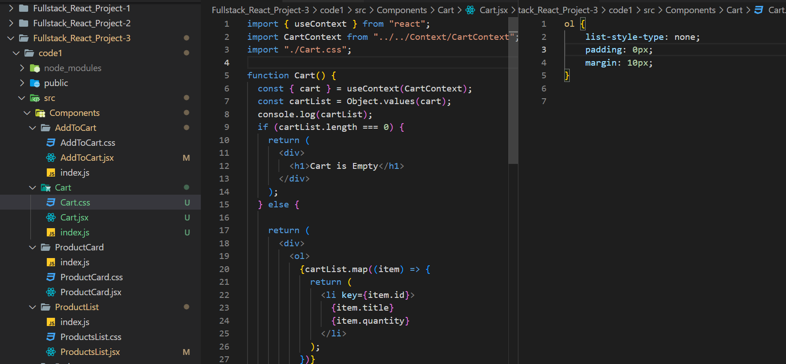
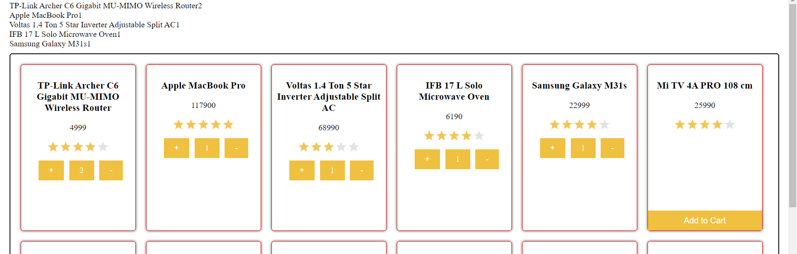
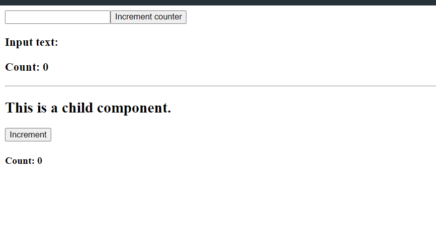
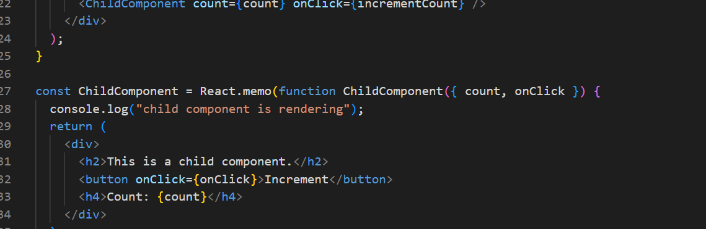
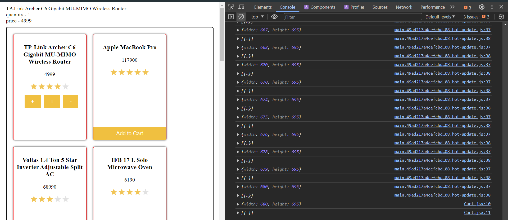
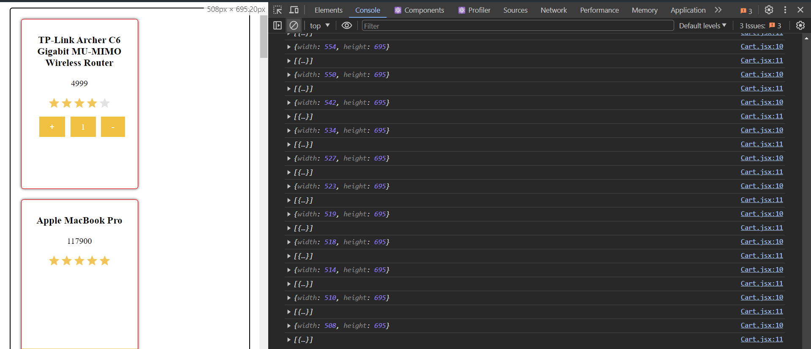
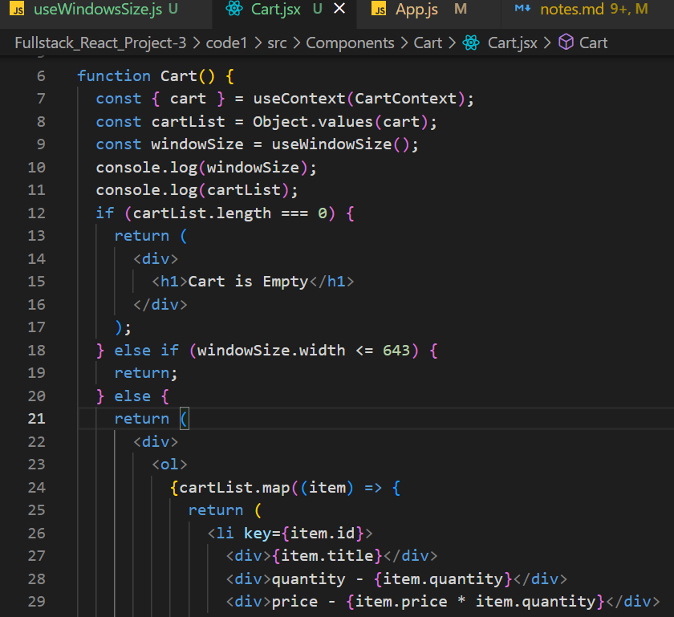

# React Project 3

*context Api*

*context Api* is a way to pass data through the component tree without having to pass props down manually at every level.

*context Api* is a way to share data between components without having to explicitly pass a prop through every level of the tree.

```js

// Context - Global state
// Provider - pseudo Parent
// Selector - Extract global state in components
//createContext - would be used in order to create your global state
//useContext- function which take a parameter and returns something
// useContext(context);
// return all the global state

```





new project code 2


basically this project is about React.memo()


*React.memo()*

React.memo() is a higher order component. It’s similar to React.PureComponent but for function components instead of classes.

If your function component renders the same result given the same props, you can wrap it in a call to React.memo for a performance boost in some cases by memoizing the result. This means that React will skip rendering the component, and reuse the last rendered result.

React.memo only checks for prop changes. If your function component wrapped in React.memo has a useState or useContext Hook in its implementation, it will still rerender when state or context change.

By default it will only shallowly compare complex objects in the props object. If you want control over the comparison, you can also provide a custom comparison function as the second argument.

```js
const MyComponent = React.memo(function MyComponent(props) {
  /* render using props */
});
```

React.memo() is a function which takes a component and makes it efficient suggesting that the change in state variable on which the child component is dependent only then the child should be re-rendered.

useCallback() is a hook that will return a memoized version of the callback function that only changes if one of the dependencies has changed. This is useful when passing callbacks to optimized child components that rely on reference equality to prevent unnecessary renders (e.g. shouldComponentUpdate).

*custom hook*

A custom Hook is a JavaScript function whose name starts with ”use” and that may call other Hooks.

*What is hook*

Hooks are a new addition in React 16.8. They let you use state and other React features without writing a class.

*Why Hooks?*

Hooks solve a wide variety of seemingly unconnected problems in React that we’ve encountered over five years of writing and maintaining tens of thousands of components. Whether you’re learning React, use it daily, or even prefer a different library with a similar component model, you might recognize some of these problems.

*What can I do with a Hook?*

Hooks are JavaScript functions, but they impose two additional rules:

* Only call Hooks at the top level. Don’t call Hooks inside loops, conditions, or nested functions.
* Only call Hooks from React function components. Don’t call Hooks from regular JavaScript functions. (There is just one other valid place to call Hooks — your own custom Hooks. We’ll learn about them in a moment.)
* React provides a few built-in Hooks like useState. You can also create your own Hooks to reuse stateful behavior between different components. We’ll look at the built-in Hooks first.
* Hooks are a way to reuse stateful logic, not state itself. In fact, each call to a Hook has a completely isolated state — so you can even use the same custom Hook twice in one component.
* Hooks are functions that let you “hook into” React state and lifecycle features from function components. Hooks don’t work inside classes — they let you use React without classes.
* React provides a few built-in Hooks like useState. You can also create your own Hooks to reuse stateful behavior between different components. We’ll look at the built-in Hooks first.
* Hooks are a way to reuse stateful logic, not state itself. In fact, each call to a Hook has a completely isolated state — so you can even use the same custom Hook twice in one component.

```js
import React, { useState, useEffect } from 'react';

function useFriendStatus(friendID) {
  const [isOnline, setIsOnline] = useState(null);

  useEffect(() => {
    function handleStatusChange(status) {
      setIsOnline(status.isOnline);
    }

    ChatAPI.subscribeToFriendStatus(friendID, handleStatusChange);
    return () => {
      ChatAPI.unsubscribeFromFriendStatus(friendID, handleStatusChange);
    };
  });

  return isOnline;
}
```







```js
   else if (windowSize.width <= 643) {
    return;


  }
```

**with windowsize width greater than 643 then only show the cart list otherwise not**

