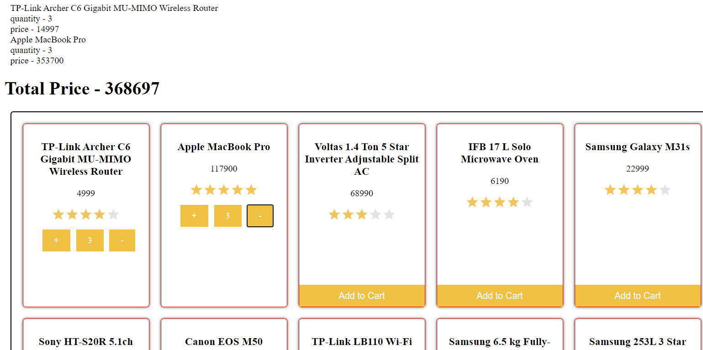
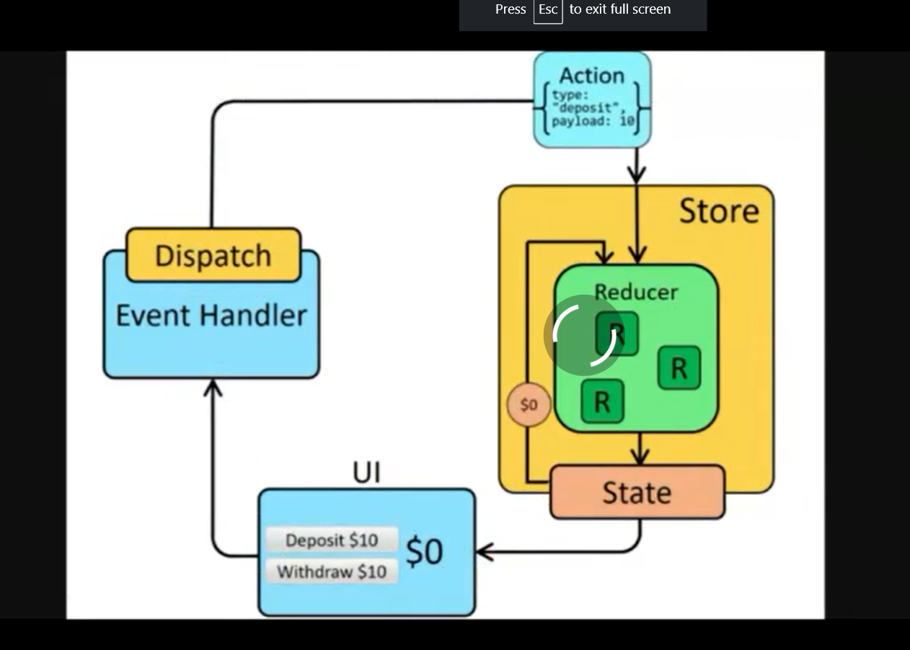

# React Project 4

```js
  let totalPrice = 0;
  function getTotalPrice() {
    cartList.forEach((item) => {
      totalPrice += item.price * item.quantity;
    });
    return totalPrice;
  }
```



## React Router

```js
import { BrowserRouter as Router, Switch, Route } from "react-router-dom";
import { Cart, Home, Product } from "./pages";
import { Header } from "./components";
import { CartProvider } from "./contexts/CartContext";

function App() {
  return (
    <CartProvider>
      <Router>
        <Header />
        <Switch>
          <Route exact path="/">
            <Home />
          </Route>
          <Route path="/cart">
            <Cart />
          </Route>
          <Route path="/product/:id">
            <Product />
          </Route>
        </Switch>
      </Router>
    </CartProvider>
  );
}

export default App;
```

Link in react dom

```js
<Link to={`/product/${id}`}>
  
</Link>
```

what it does ?
Link is a component that allows you to navigate between the routes defined inside the Router.
without refeshing the page




## Redux

```js
import { createStore } from "redux";

const initialState = {
  cart: [],
};

function reducer(state = initialState, action) {
  switch (action.type) {
    case "ADD_TO_CART":
      return {
        ...state,
        cart: [...state.cart, action.payload],
      };
    default:
      return state;
  }
}

const store = createStore(reducer);

export default store;
```

```js

import { useDispatch } from "react-redux";
import { addToCart } from "../redux/actions";

const Product = ({ match }) => {
  const dispatch = useDispatch();

  const handleAddToCart = () => {
    dispatch(addToCart(match.params.id));
  };

  return (
    <div className="product">
      <h1>Product</h1>
      <button onClick={handleAddToCart}>Add to cart</button>
    </div>
  );
};

export default Product;

```

```js
import { useSelector } from "react-redux";

const Cart = () => {
  const cart = useSelector((state) => state.cart);

  return (
    <div className="cart">
      <h1>Cart</h1>
      {cart.map((item) => (
        <div key={item.id}>
          <h3>{item.title}</h3>
          <p>{item.price}</p>
        </div>
      ))}
    </div>
  );
};

export default Cart;

```

What is Redux?

Redux is a state management library that allows you to store the state of your application in a single place. It is a predictable state container for JavaScript applications and is used to write applications that behave consistently, run in different environments (client, server, and native), and are easy to test.

