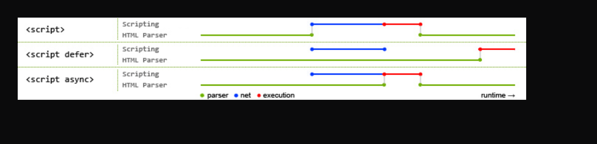

datadog server error comes to you when you are trying to run datadog-agent status command. This error comes when datadog-agent is not running on your system. You can check the status of datadog-agent by running the following command:       sudo service datadog-agent status       If the datadog-agent is not running then you can start it by running the following command:       sudo service datadog-agent start       After starting the datadog-agent you can check the status of datadog-agent by running the following command:       sudo service datadog-agent status       Now you can run the datadog-agent status command and you will not get any error.


js is block rendering in nature



script defer vs async

example of defer and async in script tag


``` javascript 

<script>
<script defer> => defer is used to load the script after the html is loaded
<script async> => async is used to load the script as soon as it is available
```

async and defer are used to load the script in parallel with the html parsing
async usage => when the script is not dependent on any other script
defer usage => when the script is dependent on any other script

real life example of async and defer

async => google analytics, facebook pixel , google tag manager
defer => google adsense, google ads, google tag manager


minify and uglify js
uglify js => it is used to minify the js code and make it unreadable for humans done on production code
minify js => it is used to minify the js code and make it unreadable for humans


sprite images => it is used to combine all the images into one image and then use it in the website

lazy loading images => it is used to load the images only when the user scrolls to that image and not load all the images at once when the page loads   => it is used to improve the performance of the website

```code 
eg =>


```


the below code is used to load the image only when the user scrolls to that image and not load all the images at once when the page loads

example took from scaler website


here data-src picked in the src attribute and the src attribute is used to load the image when the user scrolls to that image and not load all the images at once when the page loads

how to do it ?
1. use data-src attribute in the img tag
2. use src attribute in the img tag
3. use loading="lazy" attribute in the img tag
4. use the below js code in the script tag
5. use the below css code in the style tag
6. use the below html code in the html file

js code

``` javascript
<script>
    const images = document.querySelectorAll("[data-src]");

    function preloadImage(img) {
        const src = img.getAttribute("data-src");
        if (!src) {
            return;
        }
        img.src = src;
    }

    const imgOptions = {
        threshold: 0,
        rootMargin: "0px 0px 300px 0px"
    };

    const imgObserver = new IntersectionObserver((entries, imgObserver) => {
        entries.forEach(entry => {
            if (!entry.isIntersecting) {
                return;
            } else {
                preloadImage(entry.target);
                imgObserver.unobserve(entry.target);
            }
        })
    }, imgOptions);

    images.forEach(image => {
        imgObserver.observe(image);
    });

```


on scroll function 
which would be run everytime there is a page scroll 

now check for the elements which  load lazy 
are coming in the viewport or not

if they are coming in the viewport then load them   => this is done by adding the src attribute to the img tag  

below url contains the answer to the above situation

https://developer.mozilla.org/en-US/docs/Web/API/Intersection_Observer_API

check it out